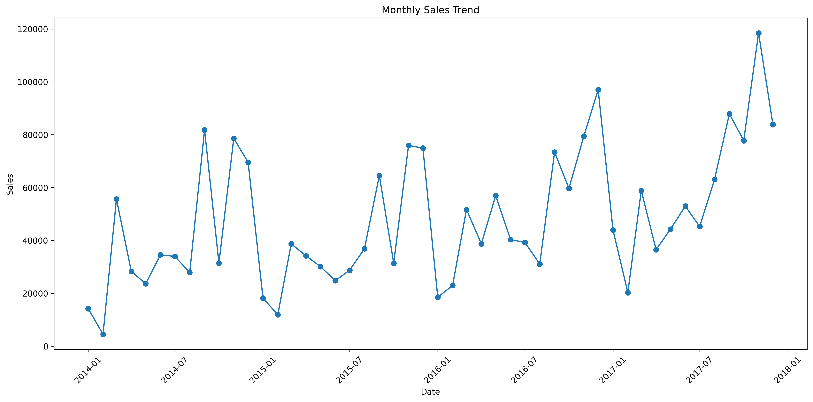
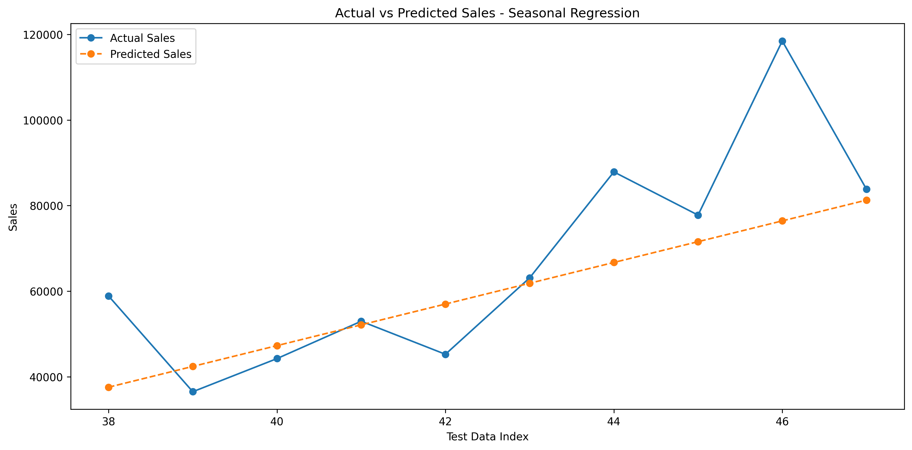
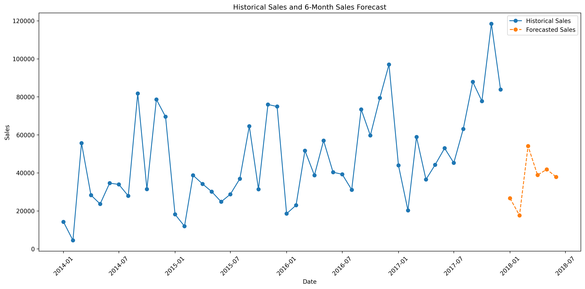

# Predictive Analytics – Sales Forecasting

## Project Overview

This project focuses on predictive analytics using historical sales data. The objective is to analyze historical sales patterns, develop predictive regression models, evaluate their performance, and forecast future sales. The project uses the Superstore sales dataset and applies data preprocessing, exploratory analysis, regression modeling, seasonal feature engineering, model evaluation, and future sales forecasting using Python.

## Objectives

- Clean and preprocess historical sales data
- Analyze monthly sales trends
- Identify seasonal patterns in sales
- Build predictive regression models
- Compare different predictive approaches
- Evaluate model performance using MAE, RMSE, and R²
- Forecast future sales for six months
- Visualize historical, predicted, and forecasted sales

## Dataset

The project uses the Superstore Dataset, containing approximately 9,994 sales transaction records.

Important features include Order Date, Ship Date, Customer Information, Segment, Region, Category, Sub-Category, Sales, Quantity, Discount, and Profit.

The dataset contains historical sales transactions from 2014 to 2017.

Dataset Source: [Kaggle – Superstore Dataset](https://www.kaggle.com/datasets/vivek468/superstore-dataset-final)

The original dataset is not included in this repository.

## Technologies Used

- Python
- Google Colab
- Pandas
- NumPy
- Matplotlib
- Scikit-learn
- Jupyter Notebook

## Project Workflow

### 1. Data Loading

The Superstore dataset was loaded into Python using Pandas.

### 2. Data Cleaning and Preprocessing

The following preprocessing steps were performed:

- Inspected the dataset structure and data types
- Checked for missing values
- Converted Order Date into datetime format
- Sorted the data chronologically
- Aggregated transaction-level sales into monthly sales totals

### 3. Exploratory Data Analysis

Monthly sales were analyzed to identify overall sales trends, monthly fluctuations, seasonal patterns, and changes in sales over time.

### 4. Predictive Modeling

Three regression approaches were developed and evaluated.

### Model 1 – Basic Linear Regression

Features used:

- Time Index
- Month

This model was used as a baseline to capture the general sales trend.

### Model 2 – Lag Feature Regression

Historical sales features were added:

- Lag 1 month
- Lag 2 months
- Lag 3 months
- Lag 12 months

This model attempted to use previous sales values to improve predictions.

### Model 3 – Seasonal Regression

The final model incorporated:

- Time Index
- Monthly seasonal dummy variables

The Seasonal Regression model performed best among the three evaluated approaches.

## Model Evaluation

The models were evaluated using Mean Absolute Error (MAE), Root Mean Squared Error (RMSE), and R² Score.

### Model Comparison

| Model | MAE | RMSE | R² |
|---|---:|---:|---:|
| Basic Linear Regression | 11,599.75 | 17,017.19 | 0.490 |
| Lag Feature Regression | 12,331.39 | 15,878.82 | 0.552 |
| Seasonal Regression | 10,797.08 | 14,420.71 | 0.634 |

### Best Model

The Seasonal Regression model was selected as the best-performing model because it achieved the lowest MAE and RMSE and the highest R² score.

- MAE: 10,797.08
- RMSE: 14,420.71
- R²: 0.634

The R² score indicates that the model explains approximately 63.4% of the variation in monthly sales in the test data.

## Future Sales Forecast

The selected Seasonal Regression model was used to forecast sales for the next six months.

| Month | Predicted Sales |
|---|---:|
| January 2018 | 26,667.29 |
| February 2018 | 17,629.22 |
| March 2018 | 54,093.87 |
| April 2018 | 38,885.01 |
| May 2018 | 41,816.04 |
| June 2018 | 37,894.45 |

According to the model, March 2018 has the highest predicted sales among the six forecasted months.

## Visualizations

### Monthly Sales Trend

### Actual vs Predicted Sales

### Historical Sales and Future Forecast

## Key Insights

- Historical sales show an overall upward trend over the analyzed period.
- Monthly sales show considerable fluctuations, indicating the presence of seasonal patterns.
- Different months demonstrate different sales behavior.
- Seasonal Regression performed better than the Basic Linear Regression and Lag Feature Regression models.
- The selected model achieved an R² score of approximately 63.4%.
- The forecast shows that future sales are expected to fluctuate rather than follow a perfectly linear pattern.
- Sales forecasting can help businesses with inventory planning, resource allocation, marketing strategies, and sales planning.

## Project Structure

- Predictive_Analytics_Sales_Forecasting.ipynb
- sales_forecast_2018.csv
- monthly_sales_trend.png
- actual_vs_predicted.png
- sales_forecast.png
- README.md
- .gitignore

## Conclusion

This project demonstrates how historical sales data can be used to develop predictive models for future sales forecasting. The Superstore dataset was cleaned and preprocessed before being aggregated into monthly sales data. Three regression approaches were developed and evaluated using MAE, RMSE, and R². Among the tested models, Seasonal Regression performed the best, achieving an R² score of approximately 0.634, an MAE of approximately 10,797, and an RMSE of approximately 14,421. The selected model was subsequently used to forecast sales for six future months from January 2018 to June 2018. Overall, this project demonstrates the application of predictive analytics, regression modeling, seasonal analysis, model evaluation, and data visualization to support data-driven business decision-making.

